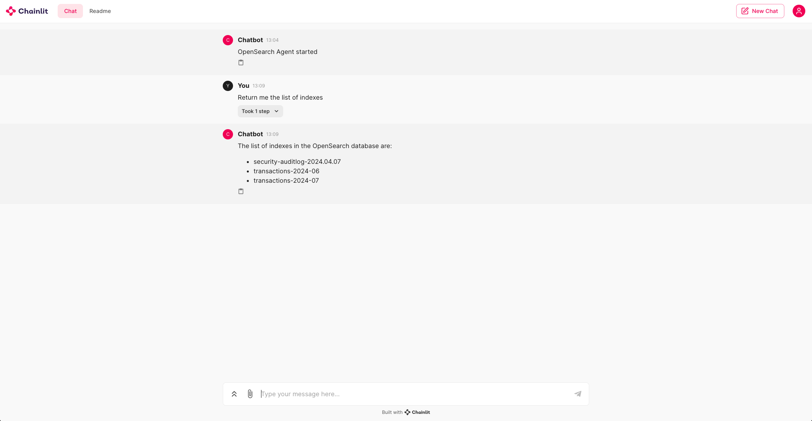
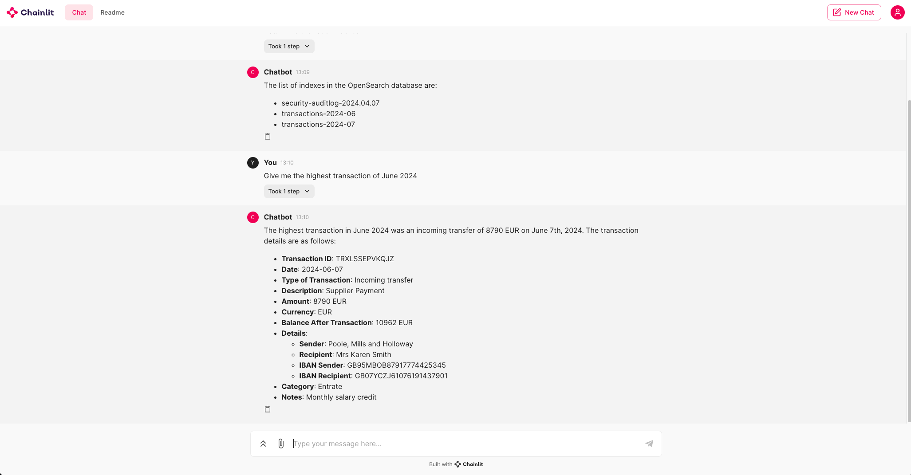
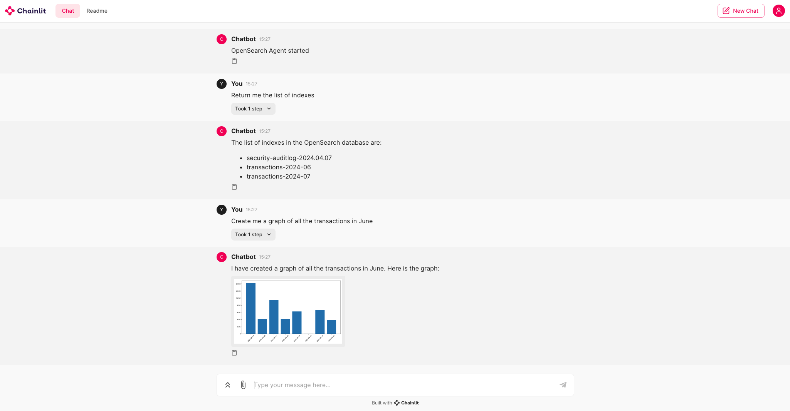

# 🦜 🤖 Opensearch Agent
This project develops an intelligent agent capable of interpreting natural language by turning it into queries for data extraction from Opensearch. It is designed to make searching and analyzing vast volumes of information more intuitive and accessible.

## Prerequisites

Before starting the installation, check that you have the following prerequisites:

- [Git](https://git-scm.com/book/en/v2/Getting-Started-Installing-Git): needed to clone the repository.
- [Poetry](https://python-poetry.org/docs/#installation): used for Python dependency management.
- [Docker](https://docs.docker.com/get-docker/) and [Docker Compose](https://docs.docker.com/compose/install/): to start Opensearch.

## Installation

### Repository Cloning

To get the project, clone the GitHub repository with the following command:

```bash
git clone https://indirizzo-del-tuo-repository.git
cd opensearch-agent
```

### Installing Dependencies with Poetry

Install the necessary dependencies by running:

```bash
poetry install
```

### Starting Opensearch with Docker Compose

Start an instance of Opensearch on your system with Docker Compose:

```bash
docker-compose up
```
This command starts Opensearch and the Opensearch Dashboard. The login credentials are admin/admin.

### Populating Opensearch with fake Data.

Run the following command to populate Opensearch with fake data:

```bash
poetry run python fake_data.py
```

After running the command, you will be able to display two indexes in your Opensearch Dashboard at `http://localhost:5601` (user: admin, password: admin) using the command `GET _cat/indices`. The transaction-related indexes are:

- transactions-2024-07
- transactions-2024-06

### Configuring environment variables.

To configure the two variables in the .env file after renaming it from .env.example, enter the following lines, replacing the example values with your specific data:

```env
OPENAI_API_KEY=sk-XXXXXXXXXXXXXXXXXXXXXXXX
FOLDER_PLOT_PATH=/Users/myuser/project/opensearch-agent/plots
```
Be sure to replace sk-.. with your actual OpenAI API key and /Users/myuser/project/opensearch-agent/plots with the actual path to the folder where you wish to work.

### Starting the Agent

Start the agent with the command:

```bash
poetry run streamlit run agent_streamlit.py
```

By following these steps, you will be able to start the Opensearch agent to explore and analyze data through a simple user interface that interprets natural language. Below is an example of queries

## 1. Return me the list of indexs

## 2. Give me the highest transaction of June 2024

## 3. Create me a graph of all the transactions in June
